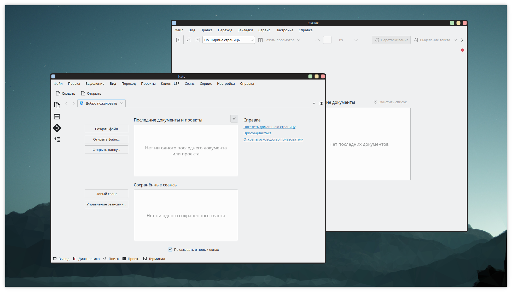

# Aurorae PureSketch Theme

I want to create a theme that is devoid of the main disadvantages that infuriate me. I don't like Aurorae themes:
- Non-working upper right corner in most schemes
- Shadows
- Strict forms

I want to make my KDE look consistent and have a lot to do. There will be many different themes. Join me.

## Contact

If you have any questions, suggestions, or just want to chat, you can find me on [Telegram](https://t.me/Zalimannard) or get in touch through [GitHub](https://github.com/zalimannard).

## License

This project is licensed under the MIT License
